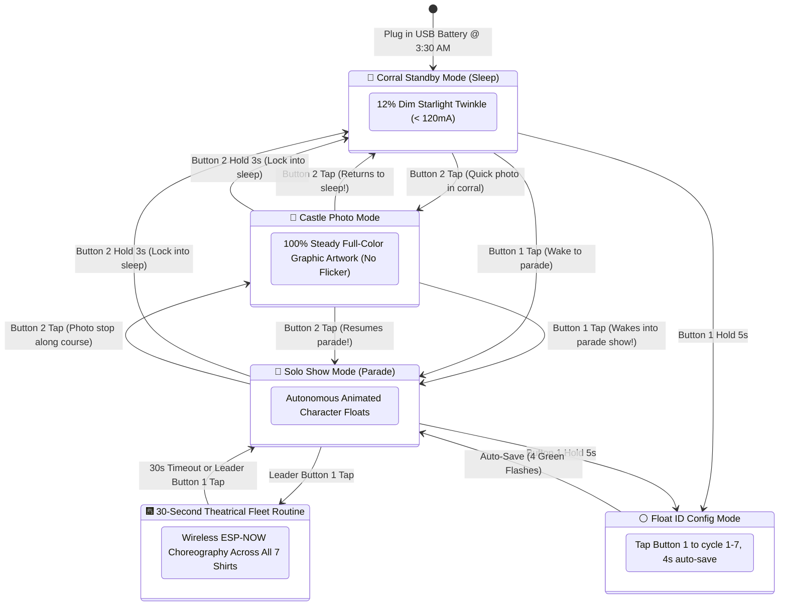

# 🏃🏰 Race Day Button Field Guide & Controller Cheat Sheet
## Main Street Electrical Parade (WDW 10K) Synchronized LED Costumes

This pocket-friendly field manual explains the complete dual-button control scheme for our **7-runner family team** on race morning at the Walt Disney World 10K.

---

## 1. Quick Pocket Cheat Sheet

```
   ┌────────────────────────────────────────────────────────┐
   │                  RUNNER CONTROLLER                     │
   │                                                        │
   │    [ BUTTON 1: SHOW DIRECTOR ]     [ BUTTON 2: PHOTO ] │
   │           (GPIO 4 / BOOT)               (GPIO 33)      │
   │                                                        │
   │    • TAP: Wake / Fleet Show        • TAP: Castle Photo │
   │    • DOUBLE TAP: Roll Call         • HOLD 3s: Sleep    │
   │    • HOLD 5s: Float ID Config                          │
   └────────────────────────────────────────────────────────┘
```

---

## 2. Leader vs. Follower Roles & Lineup

| Float # | Character | Hero Colors | Runner Role | Button Authority |
| :---: | :--- | :--- | :---: | :--- |
| **01** | **The Train (Casey Jr.)** | 🔴 Warm Red, Amber, Cyan | **👑 PRIMARY LEADER** | **Full Fleet Control:** Master clock, wake all floats, trigger 30s fleet show, fleet photo mode, fleet sleep. |
| **02** | **The Title Drum** | 🟡 Gold, White, Red | 👥 Follower | **Local Control Only:** Local wake, local photo mode, local sleep. Show cues locked to Leader. |
| **03** | **The Turtle** | 🟢 Teal, Emerald, Warm White | 👥 Follower | **Local Control Only:** Local wake, local photo mode, local sleep. Show cues locked to Leader. |
| **04** | **The Snail** | 🌸 Pink, Orange, Yellow | 👥 Follower | **Local Control Only:** Local wake, local photo mode, local sleep. Show cues locked to Leader. |
| **05** | **Cinderella's Coach** | 🩵 Cyan, Pumpkin Gold, Pink | 👥 Follower | **Local Control Only:** Local wake, local photo mode, local sleep. Show cues locked to Leader. |
| **06** | **Pete's Dragon (Elliott)** | 🟢 Emerald scales, Violet, Orange | 👥 Follower | **Local Control Only:** Local wake, local photo mode, local sleep. Show cues locked to Leader. |
| **07** | **To Honor America** | 🔵 Patriotic Blue, White, Red | **🦅 CO-LEADER / REAR** | **Full Co-Leader Authority:** Commands rear pack if runners split during the race. |

---

## 3. Actionable Button Matrix (Race Day Verified)

### 👑 Leaders (**Float 1: Casey Jr.** & **Float 7: Flag & Eagle**)

| Button & Gesture | Current State | What Happens | Visual / Serial Confirmation |
| :--- | :--- | :--- | :--- |
| **Button 1 — Single Tap** (< 600ms) | 🌙 In Sleep (Standby) | ☀️ **Wakes ENTIRE FLEET** into **Solo Show Mode** (individual float animations). Tap again to start fleet show. | 🟢 Emerald green flash on all floats. |
| **Button 1 — Single Tap** (< 600ms) | 📸 In Castle Photo Mode | ☀️ **Exits Photo Mode and wakes fleet** into **Solo Show Mode**. | 🟢 Emerald green flash, starts parade. |
| **Button 1 — Single Tap** (< 600ms) | 🏃 Running in Solo Show | 🎆 **Launches 30-Second Synchronized Fleet Routine** across all 7 floats simultaneously. | 👑 Synchronized choreography blocks. |
| **Button 1 — Single Tap** (< 600ms) | 🎬 30s Show Active | ⏹ **Stops Fleet Routine early**, cleanly returning fleet to Solo Show Mode. | 🟠 Amber double-flash confirmation. |
| **Button 1 — Double Tap** (< 400ms) | 🏃 Running Awake | ⚡ **Triggers 4-Second Rapid Attendance Roll Call Wave** sequentially from Float 1 to Float 7. | 500ms hero color wave down the pack + green finale flash. |
| **Button 1 — Hold 5s** *(White meter)* | Any State | ⚪ **Enters Float ID Configuration Mode** (reassign role 1–7 in the corral). | 1s–4s white charging meter $\rightarrow$ ⚪ 3 white flashes. |
| **Button 2 — Single Tap** (< 600ms) | 🌙 In Sleep (Standby) | 📸 **Lights up ENTIRE FLEET in Castle Photo Mode** (full graphic colors). Tap again to return to sleep. | 100% steady, solid multi-color illumination. |
| **Button 2 — Single Tap** (< 600ms) | 📸 In Castle Photo Mode | 🌙 **Toggles back to previous state** (returns to Sleep if from Sleep; returns to Parade if from Show). | Returns to previous mode with zero fuss. |
| **Button 2 — Single Tap** (< 600ms) | 🏃 Running in Solo Show | 📸 **Locks ENTIRE FLEET into Castle Photo Mode** for high-shutter group photos. Tap again to resume parade. | 100% steady, solid multi-color illumination. |
| **Button 2 — Hold 3s** *(Blue meter)* | Any State | 🌙 **Drops ENTIRE FLEET into Corral Standby Mode** (<120mA). Holding $>3\text{s}$ stays locked in sleep! | 1s–2s blue meter $\rightarrow$ 🔵 3 soft indigo pulses. |

---

### 👥 Followers (**Floats 2 to 6**: Title Drum, Turtle, Snail, Cinderella, Pete's Dragon)

| Button & Gesture | Current State | What Happens | Visual / Serial Confirmation |
| :--- | :--- | :--- | :--- |
| **Button 1 — Single Tap** (< 600ms) | 🌙 In Sleep (Standby) | ☀️ **Wakes THIS COSTUME ONLY** into **Solo Show Mode** (does NOT trigger fleet show). | 🟢 Emerald green flash on your shirt. |
| **Button 1 — Single Tap** (< 600ms) | 📸 In Castle Photo Mode | ☀️ **Exits Photo Mode locally** into **Solo Show Mode**. | 🟢 Emerald green flash, starts parade. |
| **Button 1 — Single Tap** (< 600ms) | 🏃 Running Awake | 🛡️ **IGNORED:** Prevents family runners from accidentally disrupting parade show. | Animation continues smoothly without glitch. |
| **Button 1 — Double Tap** (< 400ms) | Any State | 🛡️ **IGNORED:** Roll Call broadcast is reserved for Leader. | No action. |
| **Button 1 — Hold 5s** *(White meter)* | Any State | ⚪ **Enters Float ID Configuration Mode** (reassign role 1–7 in the corral). | 1s–4s white charging meter $\rightarrow$ ⚪ 3 white flashes. |
| **Button 2 — Single Tap** (< 600ms) | 🌙 In Sleep (Standby) | 📸 **Lights up THIS COSTUME in Castle Photo Mode** (full graphic colors). Tap again to return to sleep. | 100% steady, solid multi-color illumination. |
| **Button 2 — Single Tap** (< 600ms) | 📸 In Castle Photo Mode | 🌙 **Toggles back to previous state** (returns to Sleep if from Sleep; returns to Parade if from Show). | Returns to previous mode with zero fuss. |
| **Button 2 — Single Tap** (< 600ms) | 🏃 Running in Solo Show | 📸 **Locks THIS COSTUME into Castle Photo Mode** for individual character photos. | 100% steady, solid multi-color illumination. |
| **Button 2 — Hold 3s** *(Blue meter)* | Any State | 🌙 **Drops THIS COSTUME ONLY into Corral Standby Mode** (<120mA). Holding $>3\text{s}$ stays locked in sleep! | 1s–2s blue meter $\rightarrow$ 🔵 3 soft indigo pulses. |

---

## 4. State Flow Diagram



---

## 5. Chronological Race Morning Playbook

### 🕞 3:30 AM — Hotel Departure & Bus Staging
1. Plug the USB battery pack into your ESP32 controller.
2. The costume boots autonomously into **🌙 Corral Standby Mode** within 1.5 seconds.
3. Verify that your chest display shows a very dim, subtle midnight starlight twinkle drawing **< 120mA**.
4. Leave the costumes in Standby while on the race bus and walking to the staging area to conserve 80%+ battery.

### 🕓 4:15 AM — Starting Corral & Pre-Race Attendance Check
1. Line up with the family in Float order:
   - **01:** 🚂 Train $\rightarrow$ **02:** 🥁 Drum $\rightarrow$ **03:** 🐢 Turtle $\rightarrow$ **04:** 🐌 Snail $\rightarrow$ **05:** 🩵 Cinderella $\rightarrow$ **06:** 🐉 Dragon $\rightarrow$ **07:** 🦅 America
2. **Leader Attendance Roll Call:** Float 1 double-taps **Button 1**.
   - Watch the wave ripple smoothly down the line from Float 1 to Float 7 (500ms per runner) and end with the double emerald green flash!
3. **Pre-Race Castle/Epcot Photos:** Tap **Button 2** once.
   - All shirts glow in full, bright, vibrant graphic artwork colors with 100% steady illumination.
   - Snap crisp, motion-blur-free team photos with Disney PhotoPass photographers.
   - Tap **Button 2** again to return immediately to battery-saving Standby!

### 🕔 5:00 AM — National Anthem & Start Wave Release
1. As the start wave approaches the launch arch, Float 1 single-taps **Button 1**.
2. All 7 costumes wake simultaneously into **🏃 Solo Show Mode** with a triumphant emerald green confirmation flash.
3. Every runner's shirt is now alive with its signature float animations (spinning wheels, flickering fire breath, chugging locomotive steam, sparkling carriages)!

### 🏃 During the 10K Course (Miles 1 to 6.2)
1. **Spectator Crowds & Overpasses:** Float 1 single-taps **Button 1** while running to trigger the dazzling **🎆 30-Second Synchronized Fleet Routine**.
2. **Disney PhotoPass Stops (In front of the Castle or Spaceship Earth):**
   - Tap **Button 2** to instantly freeze the fleet in **📸 Castle Photo Mode**.
   - Pose and smile for the camera!
   - Tap **Button 2** (or tap **Button 1**) to instantly resume the animated parade!

### 🏁 Post-Race & Finish Line Celebration
1. After collecting your runDisney 10K medals, hold **Button 2 for 3 seconds**.
2. All costumes drop back into **🌙 Corral Standby Mode** to celebrate at the post-race family reunion area without blinding fellow runners!
